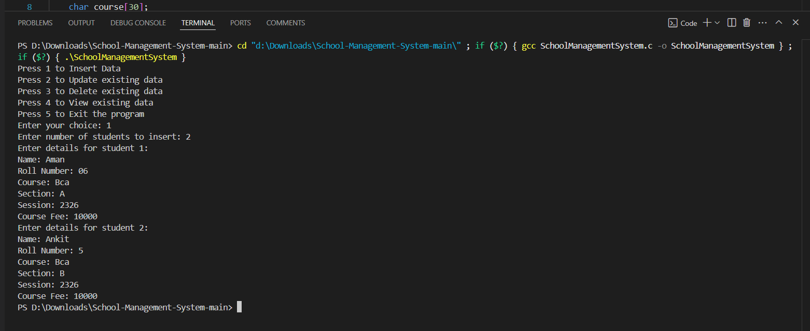
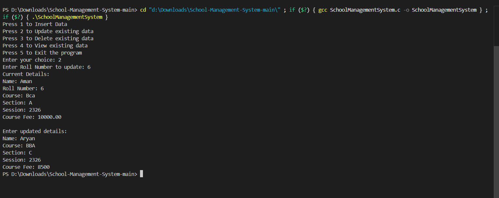
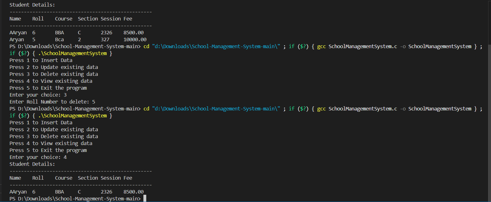
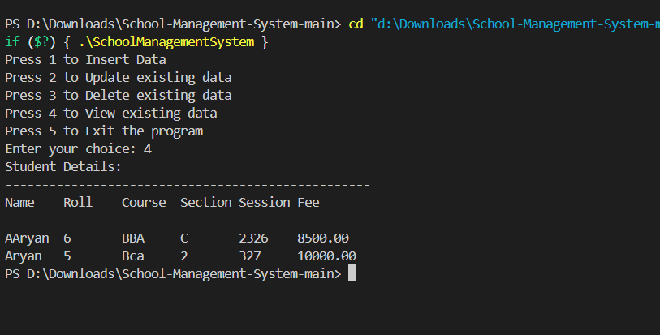

# 🏫 School Management System

## 📝 Project Overview

A powerful, command-line based School Management System crafted as part of the Bachelor of Computer Applications (BCA) curriculum. This robust application demonstrates advanced C programming techniques with a focus on efficient data management and user-friendly interactions.

## ✨ Key Features

### 🚀 Dynamic Memory Management
- **Intelligent Memory Allocation**: Runtime memory management for optimal student record handling
- **Efficient Data Structures**: Streamlined memory utilization ensuring performance and scalability

### 💾 Comprehensive File Handling
- **Persistent Storage**: Secure data preservation across application sessions
- **Robust I/O Operations**: Seamless data retrieval and storage mechanisms

### 🔧 Core Functionalities
- **Add New Students**: Effortless record creation
- **View Records**: Comprehensive student information display
- **Update Details**: Flexible student information modification
- **Delete Entries**: Precise record management
- **Intuitive CLI**: User-friendly, menu-driven interface

## 🖥️ Technical Highlights

### 🧠 Advanced Programming Techniques
- **Memory Management**
  - Dynamic allocation using `malloc()` and `free()`
  - Efficient memory handling to prevent leaks
  - Flexible data structure expansion

- **File Handling Strategies**
  - Binary file operations for compact storage
  - Secure read/write mechanisms
  - Error handling for file-related operations

- **Data Integrity Mechanisms**
  - Input validation techniques
  - Error checking and graceful error management
  - Robust data processing algorithms

### 🔍 Key Technical Implementations
- **Modular Code Design**
  - Separate functions for each core operation
  - Clear separation of concerns
  - Improved code readability and maintainability

- **Performance Optimization**
  - Minimal computational complexity
  - Efficient memory usage
  - Quick record retrieval and modification

### 💡 Innovative Approaches
- **Dynamic Record Management**
  - Real-time record addition and deletion
  - Adaptive memory allocation
  - Seamless data structure modifications

## 🎮 Usage Guide

### Main Menu Options
1. 📥 Add Student Record
2. 👀 View All Students
3. ✏️ Update Student Information
4. 🗑️ Delete Student Record
5. 🚪 Exit Application

## 🖼️ Application Snapshots

### Record Insertion

### Record Update

### Record Deletion

### Record Viewing

## 🚀 Project Context

**Academic Session:** 2023-26
**Semester:** 2nd Semester, BCA Program
**Status:** Fully Implemented and Tested ✅

## 🔮 Future Roadmap

- [ ] Advanced Search Functionality
- [ ] Sorting Capabilities
- [ ] Enhanced Data Validation
- [ ] Graphical User Interface (GUI)
- [ ] Additional Student Information Fields

## 👨‍💻 Contributor

**Developer:** AMAN KUMAR

---

**Note:** This project is part of an academic curriculum and demonstrates practical application of C programming principles.
